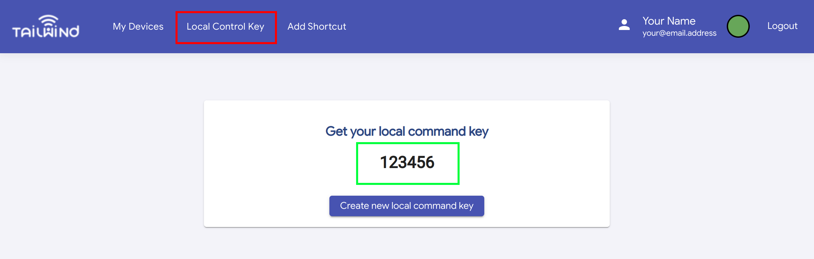

# tailwind-home-assistant
Tailwind iQ3 integration for Home Assistant

**v0.2 of this component requires V9.95 of the Tailwind iQ3 firmware.**  This version has been officially released; please update via the Tailwind app.

v0.1 of this component requires a beta firmware which has been superseded by the V9.95 release.  If you were previously using this version, you may need to delete the Tailwind integration and re-add it, as you will need to specify the Local Control Key (see below) during setup for correct operation.

The integration will create one or more Cover entities for your garage door(s).
The state (open/closed) is updated every 10 seconds via local polling - no cloud connection is required.

# Installation
For the best experience, install via [HACS](https://hacs.xyz/).
At this stage, you'll need to [add it to HACS as a custom repository](https://hacs.xyz/docs/faq/custom_repositories) using the following details:
- Repository URL: `https://github.com/pauln/tailwind-home-assistant`
- Category: `Integration`

This will result in the "Tailwind iQ3" integration appearing on your HACS integrations dashboard; from there, click the "Install" button and confirm.
Once installed, HACS will list the integration as "pending restart" until you restart Home Assistant.

After restarting Home Assistant, you should get a notification within Home Assistant that a new device has been discovered.  Following the prompt to "check it out" (or manually navigating to the Integrations page), a "Tailwind iQ3" card should appear; click the "Configure" button, select how many doors you have set up, give it a name (if desired) and enter your Local Control Key (see below) and click "submit".

If your Tailwind iQ3 isn't automatically discovered (or you've "ignored" it), you can manually add the Tailwind iQ3 integration using the "Add Integration" button on the Integrations page in Home Assistant.  You'll need to enter the IP address of your iQ3 in addition to the number of doors and Local Control Key (and optional name) as part of the manual setup process.

# Local Control Key
In order to use the local control API which this integration relies on, it's necessary to obtain your Local Control Key (a 6-digit code) and enter it as part of the integration configuration.  To obtain your Local Control Key, ensure that you've updated your Tailwind iQ3 to the v9.95 firmare and then:

1. Visit [Tailwind Web](https://web.gotailwind.com)
2. Log in with your Tailwind account
3. Click "Local Control Key" in the top menu (red box in screenshot)
4. If no key is displayed, click the "Create new local command key" button
5. Enter the 6-digit code (green box in screenshot) into the integration configuration

